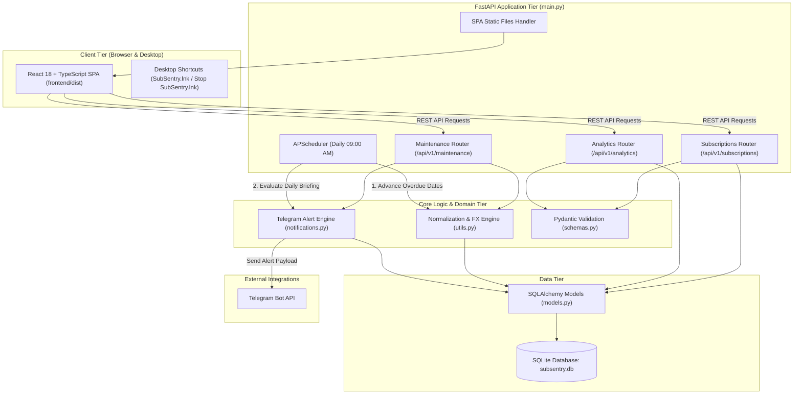

# SubSentry — System Architecture & Technical Documentation

## 1. System Overview

SubSentry is a personal subscription management and financial normalization platform. It tracks recurring software, media, and service subscriptions, normalizes irregular billing frequencies (daily, weekly, monthly, yearly) and multi-currency pricing into standard monthly totals, dispatches timely notifications before renewals and expirations, and serves an interactive React SPA dashboard.

---

## 2. Technical Stack

| Layer | Technology | Role |
| :--- | :--- | :--- |
| **Frontend UI** | React 18 + TypeScript + Vite | Single Page Application (SPA) with real-time filters and modal forms |
| **Styling & Icons** | Tailwind CSS + Lucide React | Modern dark-mode interface and responsive components |
| **Charts & Metrics** | Recharts | Donut charts with dynamic scope filtering (Paid by Me, Shared, Overall) |
| **Backend API** | FastAPI (Python 3.12) | High-performance asynchronous REST API and static SPA server |
| **Database & ORM** | SQLAlchemy + SQLite | Persistent relational storage (subsentry.db) with schema auto-migration |
| **Data Validation** | Pydantic V2 | Case-insensitive enum validators and request/response schema modeling |
| **Date Calculations** | python-dateutil | Calendar-aware date arithmetic across month/year boundaries and leap years |
| **Background Tasks** | APScheduler (AsyncIO) | Daily 9:00 AM maintenance jobs for date rollovers and alert dispatch |
| **Notifications** | Telegram Bot API | Rich daily briefing alerts with markdown formatting and urgency tags |
| **Launchers** | Batch (.bat) & VBScript (.vbs) | 1-Click desktop startup (silent or terminal) and shutdown controls |

---

## 3. Core Architecture & Data Flow

---

## 4. Key Subsystems & Domain Logic

### 4.1 Cost Normalization (utils.to_monthly & utils.to_PHP)
Subscriptions arrive in varying frequencies and currencies. SubSentry standardizes these into a uniform monthly cost:
- **Billing Cycles**:
  - `yearly`: price / 12
  - `monthly`: price
  - `weekly`: price * (52 / 12) (approx 4.333 weeks/month)
  - `daily`: price * (365 / 12) (approx 30.416 days/month)
- **Currency Normalization**:
  - Converts foreign currencies (USD, JPY, EUR, GBP, SGD, AUD, CAD) to Philippine Pesos (PHP) using configured exchange rates.

### 4.2 Automated Due Date Rollover (utils.advance_due_dates)
Whenever a billing date passes:
- The system checks if `next_due_date < today`.
- It iteratively increments the date by its cycle period (`relativedelta`) until `next_due_date >= today`.
- Prevents stale date accumulation without corrupting the original subscription cycle cadence.

### 4.3 Category Spending Breakdown & Scope Filtering
The dashboard dynamically recalculates category allocations and monthly outflow:
- **Paid by Me**: Exclusively counts personal subscriptions (`is_paid_by_me = True`) to reflect actual out-of-pocket expenses.
- **Shared**: Aggregates subscriptions paid for by others (`is_paid_by_me = False`), tracking the monetary value of shared or covered perks.
- **Overall**: Combines both personal and shared subscriptions for complete ecosystem visibility.

### 4.4 Rich Daily Briefing via Telegram (notifications.py)
- Evaluates due-soon subscriptions (within 7 days), urgent cancellation reminders, and student discount expirations (within 30 days).
- Renders an organized, structured markdown briefing with:
  - Header with execution date
  - Urgency indicators ([DUE TODAY], [IN N DAYS])
  - Normalized price, currency, cycle, and payment method details
  - 7-day upcoming outflow projection in PHP

---

## 5. Database Schema (models.Subscription)

| Column | Type | Constraints | Description |
| :--- | :--- | :--- | :--- |
| `id` | Integer | Primary Key, Index | Unique subscription identifier |
| `name` | String | Not Null, Index | Name of subscription service |
| `platform` | String | Nullable | Hosting platform or vendor (e.g., Google, Discord) |
| `plan_type` | String | Default `'solo'` | Plan tier (`solo`, `duo`, `family`, `team`) |
| `tier` | String | Nullable | Specific platform tier label (e.g., "Tier 1", "Basic") |
| `price` | Float | Not Null | Cost per billing cycle |
| `currency` | String | Default `'PHP'` | Currency code (case-insensitive) |
| `billing_cycle` | String | Default `'monthly'` | Frequency (`daily`, `weekly`, `monthly`, `yearly`) |
| `next_due_date` | Date | Not Null | Upcoming renewal date |
| `is_paid_by_me` | Boolean | Default `True` | True if user pays; False if shared/covered by others |
| `remind_to_cancel` | Boolean | Default `False` | Flag to alert user before renewal to cancel |
| `student_status_expiry` | Date | Nullable | Expiration date of educational verification |
| `category` | String | Default `'Other'` | Category tag (e.g., Entertainment, Productivity) |
| `payment_method` | String | Default `'Default Card'` | Payment source (e.g., GCash, Credit Card, PayPal) |
| `notes` | String | Nullable | Custom notes or comments |
