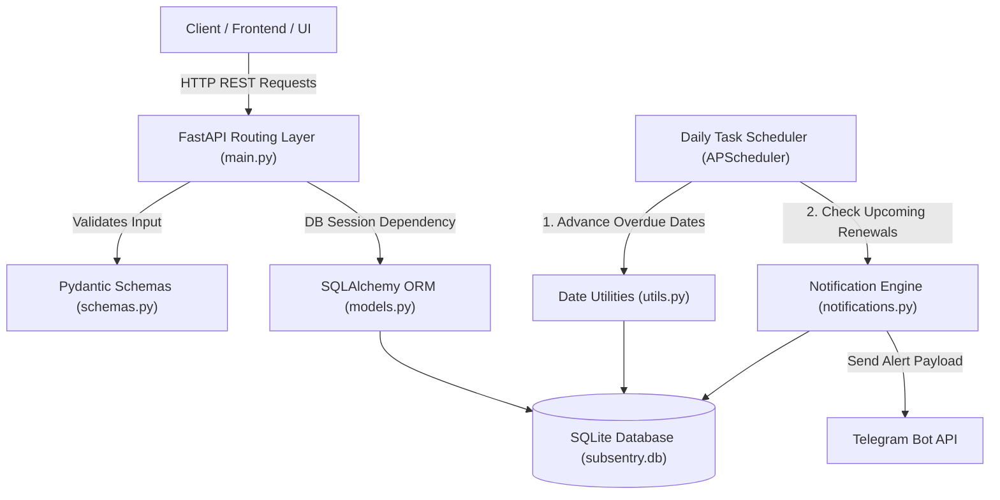

# 📘 SubSentry — System Architecture & Technical Documentation

## 1. System Overview

**SubSentry** is a subscription management and cost-normalization API designed to help users manage recurring software, media, and service subscriptions. It normalizes irregular billing frequencies (daily, weekly, monthly, yearly) and multi-currency pricing into standard monthly totals while dispatching timely alerts before renewals and expirations.

---

## 2. Technical Stack

| Component             | Technology             | Role                                                                              |
| :-------------------- | :--------------------- | :-------------------------------------------------------------------------------- |
| **Framework**         | FastAPI (Python 3.12+) | High-performance async web framework for API endpoints and OpenAPI doc generation |
| **ORM & Database**    | SQLAlchemy + SQLite    | Relational ORM and local file-based database storage (`subsentry.db`)             |
| **Data Validation**   | Pydantic V2            | Type validation, serialization, and OpenAPI schema modeling                       |
| **Date Calculations** | `python-dateutil`      | Accurate calendar math across month/year boundaries and leap years                |
| **Notifications**     | Telegram Bot API       | Automated markdown-formatted renewal and cancellation alerts                      |
| **Scheduling**        | APScheduler / Lifespan | Automated daily recurring tasks for date advancement and alert dispatching        |

---

## 3. Core Architecture & Data Flow

---

## 4. Key Subsystems & Domain Logic

### 4.1 Cost Normalization (`utils.to_monthly` & `utils.to_PHP`)

Subscriptions arrive in varying frequencies and currencies. SubSentry standardizes these into a uniform monthly cost:

- **Billing Cycles**:
  - `yearly` $\rightarrow \text{price} / 12$
  - `monthly` $\rightarrow \text{price}$
  - `weekly` $\rightarrow \text{price} \times 4.333$
  - `daily` $\rightarrow \text{price} \times 30$
- **Currency Normalization**:
  - Converts foreign currencies (USD, JPY, EUR, etc.) to base currency (PHP) using live/cached exchange rates.

### 4.2 Automated Due Date Rollover (`utils.advance_due_dates`)

Whenever a billing date passes without user intervention:

- The system checks if `next_due_date < today`.
- It dynamically advances the date using `relativedelta` based on the subscription's `billing_cycle` until the date is in the future.

### 4.3 Alert & Notification Engine (`notifications.py`)

Runs on a scheduled cadence (e.g., daily at 09:00 AM) to evaluate:

- **Due Soon**: Subscriptions with `today <= next_due_date <= today + 7 days`.
- **Cancellation Reminders**: Subscriptions marked with `remind_to_cancel = True`.
- **Student Status Expiry**: Subscriptions with verified student discounts expiring within 30 days.

---

## 5. Data Model (`models.Subscription`)

| Field                   | Type              | Description                                                  |
| :---------------------- | :---------------- | :----------------------------------------------------------- |
| `id`                    | Integer (PK)      | Unique subscription identifier                               |
| `name`                  | String            | Name of service (e.g. "YouTube Premium")                     |
| `platform`              | String (Optional) | Platform or vendor (e.g. "Google", "Discord")                |
| `plan_type`             | String / Enum     | Tier structure (`solo`, `duo`, `family`, `team`)             |
| `tier`                  | String (Optional) | Platform-specific tier (e.g. "Nitro", "Tier 1")              |
| `price`                 | Float             | Cost per cycle                                               |
| `currency`              | String / Enum     | Currency code (`PHP`, `USD`, `JPY`, etc.)                    |
| `billing_cycle`         | String / Enum     | Frequency (`daily`, `weekly`, `monthly`, `yearly`)           |
| `next_due_date`         | Date              | Upcoming payment date                                        |
| `is_paid_by_me`         | Boolean           | True if user covers the cost; False if shared/paid by others |
| `remind_to_cancel`      | Boolean           | Flag to alert user before next renewal to cancel             |
| `student_status_expiry` | Date (Optional)   | Expiration date of educational discount                      |
| `notes`                 | String (Optional) | Custom user notes or instructions                            |
